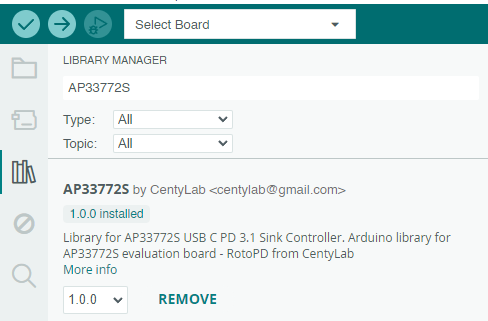
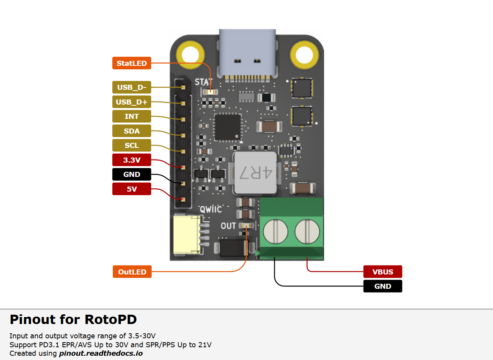
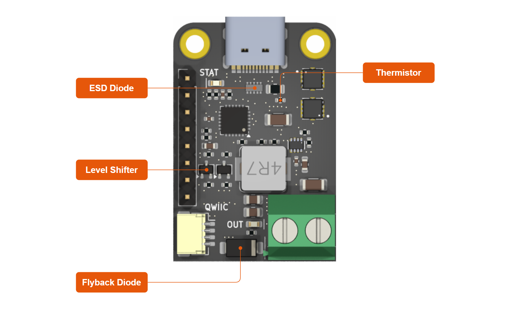
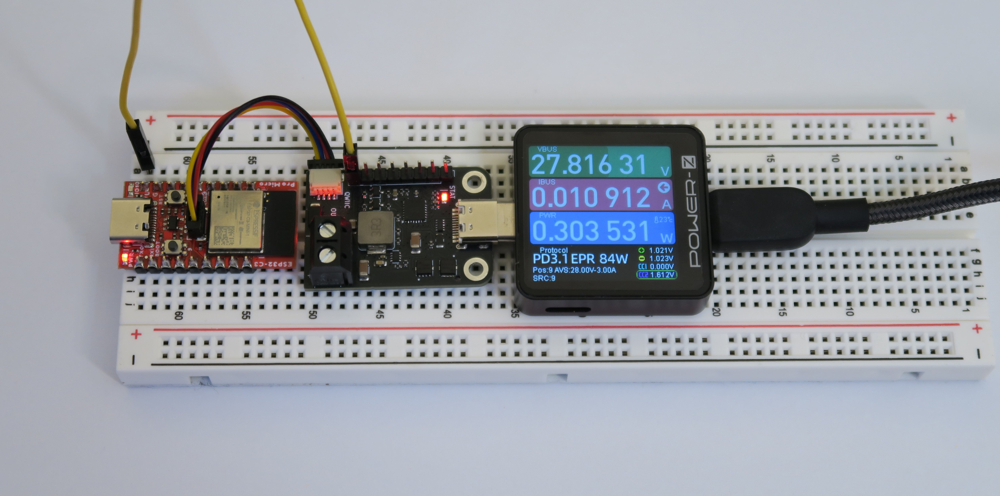

## RotoPD - USB-C PD 3.1 Breakout I2C

## Libraries
- [AP33772S Arduino - GitHub](https://github.com/CentyLab/AP33772S-CentyLab)
- [AP33772S Arduino RP2040 - GitHub](https://github.com/CentyLab/AP33772S-Cpp)
- [AP33772S CircuitPython - GitHub](https://github.com/hansendc/CircuitPython_AP33772s/) -> Thanks to [hansendc](https://github.com/hansendc)
- [AP33772S PicoSDK - GitHub]()

You can install the library directly on ArduinoIDE

## Description

While traditional power adapters can provide a variety of current but fixed to 5V output, our RotoPD leverages advanced power delivery protocols to achieve a versatile output range— 3.5V to 30V at 150W max. The breakout board use a stand alone Power Delivery Sink controller to negotiate with your modern charger and provide different output voltage.

Centylab's RotoPD can unlock more advance mode in your USB-C power supplies like Programmable Power Supply (PPS) and Adjustable Voltage Supply (AVS), to provide even more granular voltage adjustment. The RotoPD simplifies power negotiation with USB-C adapters, handling the complex process of establishing power delivery contracts. The controller does all the heavy lifting of power negotiation and provides an easy way to configure over I2C, free your micro-controller from the complicated USB-C PD protocol.

To config the board, you will need an I2C bus. The board integrates seamlessly into the Qwiic and STEMMA QT ecosystems, no soldering is required. We also include an logic level shifter on board to work with **3.3V or 5V I2C system**.

To make it even easier to use, RotoPD includes a built-in buck converter that efficiently steps down USB-C VBUS power to a stable 5V 2A output, making it perfect for powering microcontrollers, sensors, and other low-voltage components in your project.

## Requirements for AVS
To ultilize AVS power profile, you will need a powerbank or charger that has AVS profile and a 240W USB-C cable. Here are some chargers that we found support AVS profile.

+ [Framework 180W](https://frame.work/products/16-power-adapter)

+ [AMEGAT Powerbank 140W](https://www.amazon.com/AMEGAT-27600mAh-Portable-Recharge-Compatible/dp/B0CC2CGD3L)

+ [Baseus Powerbank 140W](https://www.amazon.com/Baseus-Portable-Charger-24000mAh-Charging/dp/B0CH8D2YHZ)

+ [UGREEEN Nexode 300W](https://www.amazon.com/UGREEN-Charger-Charging-Station-Compatible/dp/B0DBZY57ZF)

## Specification
+ Input and output voltage range of 3.5-30V at 5A max
+ 5V output at 2A max
+ Support Qwiic or STEMMA QT in both **3.3V and 5V I2C**
+ Support PD3.1 EPR/AVS Up to 30V and SPR/PPS Up to 21V
+ Integrated ESD and flyback diode protection
+ Integrated VBUS voltage/current monitoring
+ Integrated on-board NTC temperature monitoring
+ Integrated VBUS switch gate drivers (back-to-back NMOS)
+ Status LED for Different Negotiation Results
+ Certified USB PD3.1 v1.6  TID: 10062

## Pinout

## Demo
AVSFixed example with Sparkfun Pro Micro ESP32-C3. We are requesting AVS 28V.
